# 啊对对队大作业

## 线上地址：http://ks-form.jiangtao.website/

## 模块划分

### 通用组件

- Button 按钮


|   属性    |           描述           |                           类型                           |
| :-------: | :----------------------: | :------------------------------------------------------: |
|   type    |         按钮类型         |  'default' \| 'primary' \| 'dashed' \| 'link' \| 'text'  |
|   shape   |           形状           |             'default' \| 'circle' \| 'round'             |
|   size    |           大小           |              'large' \| 'middle' \| 'small'              |
|   icon    |           图标           |                        ReactNode                         |
| disabled  |       按钮失效状态       |                         boolean                          |
|   block   | 将按钮宽度调整为其父宽度 |                         boolean                          |
|   href    |         跳转地址         |                          string                          |
|  target   |         跳转方式         | '\_self' \| '\_blank' \| '\_parent' \| '\_top' \| string |
|  onClick  |         点击事件         |                         Function                         |
|  loading  |       是否正在加载       |                         boolean                          |
| className |           类名           |                          string                          |
|  danger   |       设置危险按钮       |                         boolean                          |

- Radio 单选框


|     属性     |       描述       |                类型                |
| :----------: | :--------------: | :--------------------------------: |
|   options    |     选项类型     | {label : string, value: string }[] |
|   onChange   | 选项改变回调函数 |   (value : string) : void => {}    |
| defaultValue |      默认值      |               string               |

- CheckBox 多选框


|     属性     |       描述       |                类型                |
| :----------: | :--------------: | :--------------------------------: |
|   options    |     选项类型     | {label : string, value: string }[] |
|   onChange   | 选项改变回调函数 |   (value : string) : void => {}    |
| defaultValue |      默认值      |              string[]              |


- DropDown 下拉菜单

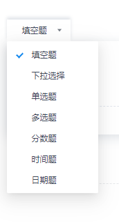


**Menu**

|   属性    |        描述        |                             类型                             |
| :-------: | :----------------: | :----------------------------------------------------------: |
|  onClick  | 点击菜单项回调事件 |                           Function                           |
|   items   |  选项改变回调函数  | ({type: "divider"} \| { label: React.ReactNode \| string,  key: string \| number, icon ?: React.ReactNode, className?: string, style?: Object, value ?: string })[] |
| className |        类名        |                            string                            |

**DropDown**

|   属性    |      描述      |        类型        |
| :-------: | :------------: | :----------------: |
|  trigger  |    触发方式    | "click" \| "hover" |
|  overlay  | 触发后显示元素 |     ReactNode      |
|   style   |      样式      |       Object       |
| className |      类名      |       string       |


- Select 选择器

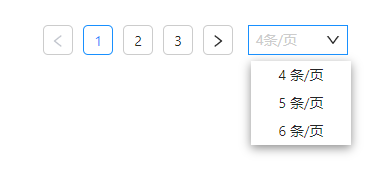

|         属性         |       描述       |                             类型                             |
| :------------------: | :--------------: | :----------------------------------------------------------: |
|        option        |    选择器数据    | Array<{label: String \| number,value: String \| number,disabled?: Boolean}> |
|        width         |       宽度       |                            Number                            |
|     placeholder      |       提示       |                            String                            |
|       disabled       |     禁用状态     |                           Boolean                            |
|       loading        |     加载状态     |                           Boolean                            |
|      showSearch      |    可输入状态    |                           Boolean                            |
|      clearable       | 可输入状态下清除 |                           Boolean                            |
| handleSelectCallback |   选择后的回调   |                           Function                           |
|   handleTextChange   |   输入后的回调   |                           Function                           |


- Input 输入框

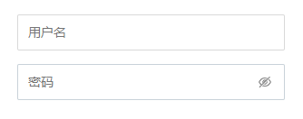

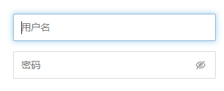


|      属性       |                    描述                     |   类型   |
| :-------------: | :-----------------------------------------: | :------: |
|      width      |                 自定义宽度                  |  string  |
|    moreStyle    |                 自定义样式                  |  object  |
|      type       |                 输入框类型                  |  string  |
|   placeholder   |                    提示                     |  string  |
|  showTogglePwd  | 显示密码切换按钮(需同时设置type="password") | boolean  |
| handleIptChange |             输入框内容改变回调              | Function |
| handleIptFocus  |               输入框聚焦回调                | Function |
|  handleIptBlur  |             输入框失去焦点回调              | Function |
|  handleKeyDown  |               输入框键盘监听                | Function |
|  defaultValue   |                  默认内容                   |  string  |

- Textarea 输入框

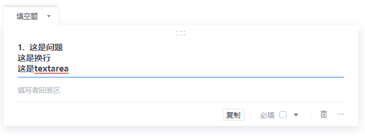

|    属性     |        描述        |   类型   |
| :---------: | :----------------: | :------: |
|    style    |        样式        |  Object  |
|  className  |        类名        |  string  |
|    value    |      输入框值      |  string  |
|   onBlur    |    失去焦点事件    | Function |
|  onChange   | 输入框内容改变事件 | Function |
|  onkeydown  |  键盘点击输入事件  | Function |
| placeholder |      提示信息      |  string  |
|  maxLength  |      最大长度      |  number  |
|  editable   |     是否可编辑     | boolean  |

- message 消息提示


|   属性   |          描述          |  类型  |
| :------: | :--------------------: | :----: |
|   text   |        提示信息        | string |
| duration | 提示框持续时间(默认3s) | Number |


- Modal 模态框

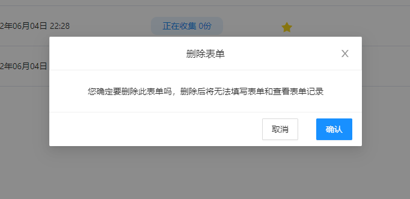

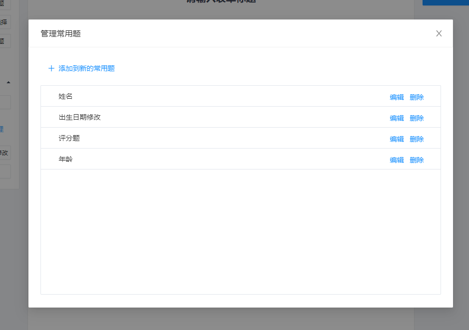

|  属性   |   描述   |           类型            |
| :-----: | :------: | :-----------------------: |
| visible | 是否显示 |          boolean          |
|  title  |   标题   | string \| React.ReactNode |
| footer  | 底部按钮 |      React.ReactNode      |
| onClose | 关闭函数 |         Function          |
|  width  |   宽度   |          number           |
| height  |   高度   |          number           |


- Pagination 分页器


|          属性          |         描述         |      类型      |
| :--------------------: | :------------------: | :------------: |
|         total          |      总数据条数      |     number     |
|    showSizeChanger     |  显示每页条数Select  |    Boolean     |
|    pageSizeOptions     |     每页条数配置     | Array<number\> |
|     showJumpInput      |   改变页码后的回调   |    Boolean     |
|   changePageCallback   |  显示跳转页面输入框  |    Function    |
| changePageSizeCallback | 改变每页条数后的回调 |    Function    |

- SelectList 菜单


|   属性   |      描述      |   类型    |
| :------: | :------------: | :-------: |
| pullable | 是否可关闭打开 |  boolean  |
|   open   |  初始是否打开  |  boolean  |
|  title   |      标题      |  string   |
| manager  |      管理      | ReactNode |


- Star 评分


|     属性      |      描述      |   类型   |
| :-----------: | :------------: | :------: |
|   editable    |   是否可编辑   | boolean  |
| onScoreChange | 分数改变时事件 | Function |
|     score     |      分数      |  number  |
|   maxScore    |    最大分数    |  number  |
|     size      |    星星大小    |  number  |
| defaultColor  |   未选中颜色   |  string  |
|  activeColor  |    选中颜色    |  string  |

### 业务模块及组件拆分

- 登录注册页
  - `SignLayout`  登录注册布局组件

- 个人中心页
  - `AccountHeader` 登录页header组件
  - `AccountInfo` 登录页个人信息组件
  - `AccountBox` 登录页下单项组件


- 首页
  - `HeaderLayout` 顶部header组件(提供左边和中间内容扩展点)
  - `SideBar` tab栏组件
  - `Table` 表格组件
- 新建表单-构建页
  - `HeaderLayout` 顶部header组件
  - `QuestionList`  左侧问题列表组件
  - `ToolList` 右侧功能组件
  - `QuestionContent`  中间内容组件
    - `EditTitle` 可编辑标题组件
    - `WatchTitle`   预览标题组件
    - `EditSubTitle`  可编辑子标题组件
    - `WatchSubTitle` 预览子标题组件
    - `Module` 问题组件(被当前组件包裹的组件可实现点击高亮状态)
    - `ToolMenu` 问题操作栏组件
    - `DragModule` 问题组件拖拽时展示的组件
    - `EditInput` 编辑输入框问题组件
    - `EditableInput` 填写输入框问题组件
    - `WatchInput` 查看输入框结果组件
    - `EditDateTime` 编辑时间日期问题组件
    - `EditableDateTime` 填写时间问题组件
    - `WatchDateTime` 查看时间问题组件
    - `EditScore` 编辑分数问题组件
    - `EditableScore`  填写分数问题组件
    - `WatchScore` 查看分数问题组件
    - `EditSelect` 编辑选择题问题组价
    - `EditableSelect` 填写选择题问题组件
    - `WatchSelect` 查看选择题问题组件
- 新建表单-预览
  - `HeaderLayout` 顶部header组件
  - `EditableProblemContent`  表单填写组件(状态为不可编辑)
- 填写详情-数据统计
  - `HeaderLayout` 顶部header组件
  - `WatchProblemContent`  预览组件
- 填写详情-问题查看
  - `HeaderLayout` 顶部header组件
  - `EditableProblemContent`  表单填写组件(状态为不可编辑)
- 填写详情-分享
  - `HeaderLayout` 顶部header组件
- 表单填写页-PC端
  - `HeaderLayout` 顶部header组件
  - `EditableProblemContent`  表单填写组件(状态为可编辑)
- 表单填写页-手机端
  - `EditableProblemContent`  表单填写组件(状态为可编辑)

### 其它

- 路由

路由采用配置的方式，自定义`useGuard`钩子，实现路由守卫，在每一次路由跳转时进行登录状态的检验，以及在url中有`cb`参数时，登录完成后自动跳转到`cb`中对应的路由

```
const routes : GuideRouteObject[] = [
    {
        path: "/signin",
        element: <Signin />,
        meta: {
            logRe: "/form-list" // 登录后跳转路由
        }
    },
    .....
]
// 在每次跳转路由时会调用当前函数，需要拦截跳转可以返回一个路由
function beforeEach(now: LocationType, meta: any, last: LocationType) {
    // 权限校验
    // 已登录跳转
    // 带有cb参数的跳转
}

useGuard({
    routes,
    beforeEach
})
```

在axios对错误进行统一处理，当未登录时，跳转登录页面，并携带当前请求页面，以便后续登录后直接跳转到请求页面

- 请求

为了便于调用，将接口统一封装为以下格式

```
export function register(data : IRegisterReq){
    return API.post('/api/auth/register', data)
        .then(res => res.data)
        .catch(res => res.data)
}
```

## 小组分工

- 蒋涛
  - 项目结构搭建
  - 路由守卫
  - 表单创建页、填写页面(PC端和手机端)、预览页面
  - 表单创建组件、表单填写组件、表单查看组件
  - 表单问题拖拽和选择题拖拽
  - 通用组件封装：Button按钮、Checkbox多选、Radio单选、Textarea编辑框、Stars分数组件、Message全局消息提示组件、Dropdown下拉菜单、SelectList菜单
  - redux全局状态管理
  - 修改填写详情页问题
  - 实现上传图片接口
  - 测试

- 欧阳华清
  - 首页
  - 登录注册布局组件和首页个人中心等页面header组件
  - 封装通用组件：Input输入框、Select下拉框、Pagination分页器
  - 封装axios请求和全局异常处理
  - 修改登录注册页、个人中心页问题
  - CSS模块化改写
  - 测试


- 欧才旺
  - 个人中心页
  - 通用组件封装：Modal模态框
  - 测试

- 赵玥
  - 填写详情-分享页
  - 填写详情路由配置
  - 修改页面跳转问题
  - 个人中心头像上传组件、下拉框组件的封装
  - 测试

- 陈小平
  - 登录注册页
  - 表单填写页进度提示组件
  - 修改页面层级问题
  - 测试

## 项目说明

### 技术选型

#### 框架

- `react`

#### 语言

- `typescript`
- `scss`

使用css module防止类名冲突

#### npm包及其作用

- `react-redux 8.0.1`    `redux-thunk 2.4.1`

由于用户信息多处使用，使用`redux`和`redux-thunk`保存用户信息，并在内部异步请求数据，并且只在无用户信息时请求，保证只对获取用户信息接口请求一次

- `react-router 6.3.0`    `react-router-dom 6.3.0`

使用`react-router`做路由管理，由于`react-router`不能直接使用路由守卫，自定义一个钩子依赖于`useRoutes`实现类似`vue router`的路由守卫功能

- `@ant-design/icons 4.7.0`  `antd 4.20.7`

使用改库中部分图标

- `node-sass 7.0.1`

将`scss`文件编译成`css`文件

- `react-dnd 16.0.1`   ` react-dnd-html5-backend  16.0.1`

使用`useDrag`、`useDrop`钩子，实现对拖拽源和放置源位置等数据的管理，从而实现页面的拖拽效果。使用`useDragLayer`实现对拖拽效果的重新绘制，弥补浏览器拖拽事件效果问题

- `axios 0.27.2`

用于请求数据，对响应进行拦截统一管理，实现未登录状态下跳转和错误信息的提示

- `classnames 2.3.1`

className合并工具，解决判断条件带来的代码较复杂问题

- `html2canvas 1.4.1`   `react-qrcode-logo 2.7.0`

生成二维码，将html转成canvas，再生成图片

- `lodash 4.17.21`

使用了其中的节流函数，处理拖动抖动问题

- `moment 2.29.3`

格式化时间和时间的基本操作

- `nanoid 3.3.4`

随机生成id，实现key的生成，以便于dom复用

- `cross-env 7.0.3`  `customize-cra 1.0.0`  `react-app-rewired 2.2.1`

在启动命令时设置环境变量，实现本地服务器和线上服务器的动态切换。通过动态配置webpack实现`@`作为根目录，防止出现`../../`这样的路径

- `http-proxy-middleware 2.0.6`

实现前端代理，解决跨域问题

### 运行说明

```bash
$ npm i
// 使用线上服务端运行
$ npm run start:service
>> cross-env REACT_APP_ENV=SERVICE react-app-rewired start
// 使用本地服务端运行（服务端端口需要改为3001）
$ npm run start:localhost
>> cross-env REACT_APP_ENV=LOCALHOST react-app-rewired start
// 打包构建
$ npm run build
>> react-app-rewired build
```

- 线上地址(http://ks-form.jiangtao.website/)
- 线上服务端地址(http://form.api.jiangtao.website/)
- 线上图片上传接口(http://upload.jiangtao.website/upload/image)

```
请求：
POST
{
	file : binary
}
返回：
{
    "url": "http://images.jiangtao.website/images/08e60562-14f7-44d4-b104-cbdebd2d1db0.png",
    "status": "200"
}
```

## 项目亮点

### 组件封装和复用

- 除了`ant design`中的日历日期组件和上传图片组件外，其它组件全部是自己封装
- 填写页面，创建页面组件可复用，下图pc端和手机端复用同一个组件

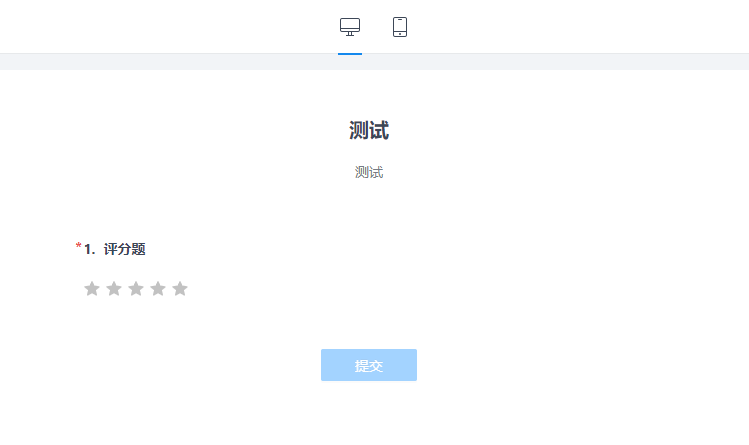


- 问题创建和常用题管理复用同一个组件


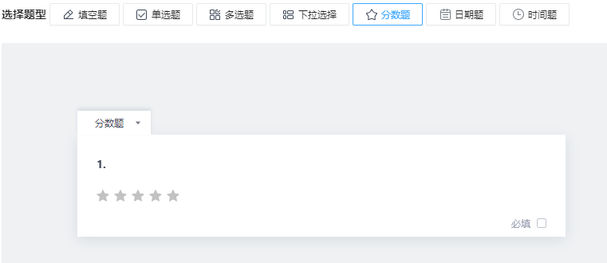

### 拖拽效果

- 使用`react dnd`实现拖拽效果，并实现拖拽时的效果以及拖拽边界限制

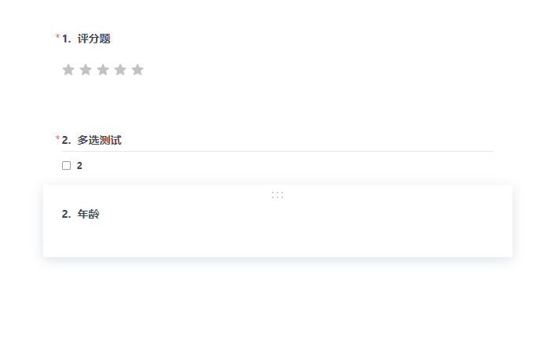

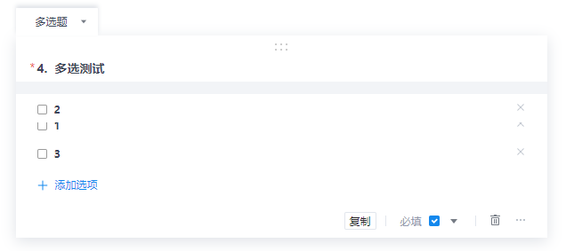

### 路由守卫

- 自定义`useGuard`钩子，实现类似`vue router`的路由守卫。可在路由配置`meta`，在每次路由跳转时拦截并根据`meta`进行路由守卫

### 图片上传

- 实现图片上传接口并部署到服务器，实现上传图片并返回图片链接

### 提示信息较为完善

- 创建表单和提交表单存在提示信息，防止用户提交错误信息


## 每周(日)进度

### 蒋涛

#### 第一周

- 搭建项目结构，引入将使用到的npm包，搭建项目路由、拆分页面组件，判断页面之间可以复用的组件，搭建简单的项目结构
- 了解react路由守卫实现方式，自定义路由守卫钩子，实现通过配置文件中meta对每次路由跳转进行拦截，实现路由守卫，使用axios进行全局错误处理，实现未登录状态下不能进入需要登录页面
- 将后端代码部署到服务器上，配置nginx，测试部署项目，并使用jenkins实现自动化部署
- 确定全局状态并使用，使用异步优化全局状态中的用户信息，使得请求用户信息接口在全局只调用一次，并当用户信息被修改后可以强制刷新数据
- 封装通用组件Button按钮、Message全局消息提示组件
- 开会确定项目具体需求和分工

#### 第二周

- 实现表单创建页选择题、填空题、分数题
- 实现PC端表单填写页面，并复用组件实现手机端表单填写页
- 实现表单创建也预览功能
- 实现表单预览组建
- 封装Checkbox多选、Radio单选、Textarea编辑框、Stars分数组件、Dropdown下拉菜单、SelectList菜单
- 修改部分组件，使其适应现有的应用场景
- 合并代码，解决冲突，修复现有问题

#### 第三周

- 学习react dnd了解其实现拖拽的原理，实现表单问题的拖拽和选择题选项的拖拽
- 修改拖拽跟随组件，使其x轴不会脱离指定区域，实现拖拽的边界限制
- 修改创建表单页面中为输入标题、副标题、问题、选项或问题为空时的提示信息和禁止预览、保存草稿、创建表单
- 修改问题填写页面必填问题的提示，以及必填问题全部填写才允许提交
- 修改路由守卫和axios全局错误处理中对未登录状态从当前页面跳转到登录页面后，登录后再次跳转到原页面
- 实现上传图片接口
- 修改数据统计页面未填非必填问题展示问题
- 合并代码，解决冲突，修复现有问题

### 欧阳华清

#### 第一周

- 开会确定项目具体需求及各个实现细节与分工，规定编码规范如项目全部使用函数式组件，确定使用到的各种技术的版本。学习`git`分支的管理与操作，克隆自己仓库的分支并测试提交
- 配合组长搭建项目的初始结构，主要任务为引入`axios`请求库再根据提供的接口文档封装四大模块请求和发送数据的各个方法,方便小组成员后续直接调用,具体为本项目`src`目录下的`services`层。
- 编写布局组件(layout),主要包括`HeaderLayout`和`SignLayout`
- `HeaderLayout`将在首页、个人中心、新建表单界面及登录注册框使用到
- `SignLayout`将在登录注册框布局中使用到

- 封装Pagination (分页器) 组件和Select（下拉菜单）组件并将二者功能结合，方便首页表格展示功能的需要

- 搭建好首页的基本结构，主要为Header，Sidebar，Content

#### 第二周

- 封装`Input`组件，将登陆框、注册框、修改密码时模态框的输入框全部改用封装的此组件

- 使用`memo`和`useMemo`将封装的组件（Pagination、Input、Select）包裹起来以提升性能，让子组件只在数据发生变化时才重新执行相应的代码
- 封装首页的表格，完成数据的正常渲染和展示
- 根据后端返回的时间戳在创建时间一栏使用`moment`库的`moment.format`方法处理时间为标准的格式化时间
- 完成表单的标星和仅展示星标功能
- 将表格的数据展示与封装的分页器和下拉菜单功能结合，实现分页功能

#### 第三周

- 完成项目整体的`css`模块化避免可能出现的`css`污染
- 修复个人中心修改密码模态框点击关闭按钮无法关闭的问题
- 修复首页表格展示删除数据后数据显示不正常的问题，删除一条数据后要从后面补上
- 修复登录注册框部分验证逻辑错误的问题
- 新增点击首页表格的表单栏根据状态直接跳转的功能，当状态为草稿时，点击可直达编辑界面，当状态为正在收集和已结束收集时，点击该栏可直达收集的结果界面
- 新增首页无数据时的展示页面
- 新增请求到数据之前的加载状态
- 新增输入框的一些提示（按照提示进行相应操作才能注册，如密码长度必须符合要求、两次输入的密码必须一致等，否则注册按钮一直为disabled(不可用)状态）

### 欧才旺

#### 第二周

05.26 完成模态框的封装

05.27 参照`https://account.wps.cn/usercenter/apps`完成个人详情页面（Account）的基本布局

05.28  将个人中心分为了三个部分AccountHeader、AccountInfo、AccountBox。AccountHeader部分完成了退出登录功能，修改scss为module.scss。提交第一版Acount页面。

05.29 修改了个人中心的AccountBox组件。预留了插槽接收Box的主体内容，采用props传入children。其中children为ReactNode。并修改了Account页面的index.tsx传入相应的节点。

#### 第三周

05.30 完成个人中心修改名称功能

05.31 完成个人中心修改密码功能

### 赵玥

#### 第二周

05.23  完成填写详情页面基本框架搭建
05.24  完成详情页面路由跳转的实现，使用hash路由
05.25  完成分享页面二维码的生成以及下载
05.26  完成完善填写详情页面细节

#### 第三周

06.01  完成整体页面逻辑bug测试，以及细节优化处理（文字显示、返回等）
06.02  完成下拉框组件的封装实现
06.03  完成个人中心头像上传组件的一部分处理

### 陈小平

#### 第一周：

1. 完成了react路由的作业，学习了react路由中的一些基础标签的用法，能够通过react路由去完成页面的跳转以及react路由跳转时用search,state等来进行参数的传递，由于完成作业时使用的路由版本是V5的，做项目时要用到的路由是V6的，所以去学习了一些react路由V6版本的最新API，以及一些更新过后的写法，个人觉得新版路由最方便的地方便是像Vue一样使用路由表来进行路由的统一管理，这对后续的一些路由操作来说非常方便。

2. 项目的前期准备阶段，熟悉了一下后台的一些接口的用处，在新建的react项目中去试着调用一些接口，查看返回的属性以备后面使用到的时候能够更快清楚是否调用成功，该怎么进行下一步的一些操作。去给的接口里查看后台的一些操作具体是怎么进行的，加深了对各种接口需要用到的参数的理解，学习了部分node.js的内容，对于一些数据的流入流出有了一个大概的认识。

3. 因为计划大作业的完成过程中，统一使用函数式组件而非类式组件，所以开始了一些react hooks的学习，基础的学习了useState，useRef,useEffect的用法，并从react官网上学习了一些例子，学会运用这三个函数钩子，便可以去完成许多类式组件的功能，从使用函数式组件来看，它的许多写法会比类式组件简单不少，比如在类式组件也许有的操作需要在不同的生命周期函数中完成，但是在函数式组件中仅用useEffect一个钩子函数便可以去模拟完成。从react官网上可以得知以后的趋势也是使用函数式组件。

4. 组长下发大作业的分工任务，并计划定时上传代码，以及时完成大作业。

#### 第二周：

1. 开始进行大作业的开发任务，主要完成了页面的注册登录以及表单的填写等模块的开发，在完成的过程中，加深了对一些钩子函数的理解，也能够更加熟练的去运用这些钩子函数，在注册与登录界面，尝试去使用useRef，useState来分别完成，useRef钩子函数的功能比想象中的强大，它能够一直保存一个状态，通过useRef绑定的ref是通过current属性来进行操作，useState则是设置初始状态以及提供一个可以去改变它值的函数。
2. 表单填写页面需要接收到被填写表单的id,由于是在函数式组件中，所以这个时候需要用到react路由中的useNavigate函数，通过这个函数，再结合路由表来使用，便可以成功进行路由的跳转以及表单id的传输，在接收页面，则需要使用到useLocation函数来接收传输过来的id,以此来获取表单的内容，在获取到之后，再去调用接口去提交表单中的内容。以进行后续的操作。
3. 完成了一些功能，比如注册页面密码强度的校验，通过正则表达式来检验密码的强度如何，并将密码的强弱显示出来，但由于开发过程中速度有点快，在使用useRef时，对它如何去操作结点的style属性发生了一些偏差，导致最后只能去对结点的类名去进行操作，导致代码过于冗余，后续将此部分删除。在表单填写页面，试着去完成填写进度的功能，通过函数计算出表单中已完成的和总共的百分比，然后通过计算出的百分比控制进度条的高度以实现此功能。
4. 这周最后一次课学习了sass的一些基本用法，以及style.module.scss的使用，并且对状态管理有了一些了解，由于项目中要使用redux,所以学习了redux的一些操作，对于它的action，store，reducer的基本工作流程有了一定的了解，能够自己去使用redux来进行一些状态的管理。
5. 学习了ant-design组件的使用，并且试着去封装一些ant-design组件来进行使用。

#### 第三周：

1. 深入的去学习了react hooks，接触到了更多的react hooks,比如useReducer,useMemo,useCallback，useContext等钩子函数，能够去使用它们去完成一些基础的功能，在使用的过程中更加了解了其中的工作流程。去深入理解了它的一些使用规则，比如只在最顶层去使用hook,只在react函数中调用hook。学习了自定义hook,简单模仿封装了一个自定义hook,自定义hook的开头必须是use开头。
2. 尝试去完成了一些其他小组成员的任务，去理清楚整个项目的工作流程，对于之前使用的还不够熟练的一些ts操作去进行了练习，模仿学长对一些接口的封装以及对于后台数据的接口的定义。(对于一些封装没有理解清楚而导致在使用的过程中出现了诸如缺少接口中定义的属性等问题)。在模拟完成其他小组成员的任务的时候加强了对于ts的使用，以及一些功能函数的定义，比如表单的创建这块较为核心的部分。
3. 开始对项目进行一些bug的检查与修复。

## 问题与解决方法

### 蒋涛

1. axios为登录跳转生成`cb`参数在路由守卫中解码后会缺失

解决方式：使用`encodeURIComponent`进行编码，`decodeURIComponent`进行解码。因为`encodeURI`不会对`#`进行编码

2. 问题拖拽出现多次交换，导致页面较卡顿

解决方法：使用节流函数，是0.1s内只能出现一次交换

3. 选项交换不存在交换效果

解决方法：由于react根据key只进行dom的复用，每次渲染需要保证相同的dom的key值相同。之前是因为随机生成key，导致每次组件刷新后选项都会被重新创建。在选项数据中加上与兄弟节点相比唯一的id，使得相同选项的数据的dom可以复用，可以实现拖拽交换效果

4. react router未实现类似vue router的路由守卫

解决方法：依赖于`useRoutes`封装hook，使得在每次跳转之前都会执行路由守卫方法，并传入之前路由信息、跳转路由信息以及跳转路由的meta，实现类似于vue router的路由守卫

5. 项目部署后，出现访问非根节点无法访问的问题

解决方法：配置nginx，使其每次无法找到html文件时，自动重定向到index.html文件

6. 原生textarea无法自动调整其高度，且使用较多

解决方法：封装Textarea组件，通过操作dom设置其高度，使其可以自动调整其高度，并对外暴露常用的事件

7. 修改图像或用户名后无法页面无法更新

解决方法：由于redux中请求用户信息为异步方法并且只有在用户信息为空时才会请求数据，修改用户信息后需要强制刷新，请求数据

8. 下拉菜单被覆盖问题

解决方法：由于absolute会脱离文档流，需要设置其z-index划分图层

9. 点击任意地方，focus的问题需要消失

解决方法：document上绑定onclick事件，且需要阻止其他事件的冒泡

10. 父组件无法拿到子组件event参数

解决方法：子组件在调用父组件传入的方法时，需要传入event参数


### 欧阳华清

1. 编写布局组件时使用了模块化`css`,但后续被用到时部分样式需要被重写覆盖，更正后改为普通的`scss`文件

2. 做类的拼接时特定状态增加样式，此前一直使用三元运算符但过于依赖状态还有可能要新增不必要的状态。引入classNames库后解决了这一问题

3. 分页器分页计算错误。修改分页器分页部分实现逻辑后功能

   

   

   


4. 改变每页显示的数据条数后无响应问题。在Pagination组件中新增一个回调函数传递相应的值给父组件

```ts
//select回调
const handleSelectCallback = (pageSize: any) => {
    console.log(pageSize.value)
    setSizePage(pageSize.value)
    // 加一个回调函数，设置每页展示数据的条数
    changePageSizeCallback && changePageSizeCallback(pageSize.value, nowIndex);
};
```

5. 表单停止后无法继续收集。新增一个继续收集的状态，效果等同于发布

6. 使用memo将封装的组件包裹时增加了一个监听函数发现无论子组件的值改变与否，不相关的代码依然会被执行，使用useMemo解决了函数因更新数据而重新渲染自己的问题

7. `css`模块化时遇到的依赖和加载顺序问题，部分组件在渲染时并没有引入外部`css`,而是使用的子组件的样式或者行内样式，当需要对整体样式进行模块化时出现了加载顺序的混乱问题，理清后解决了这一问题
8. 个人中心修改昵称成功后需要显示昵称的地方并没有更改，使用`redux`全局状态管理后解决了这一问题
9. 同步异步的问题，在一些组件中的useEffect函数里请求到数据并set之后直接拿这个数据去用，发现出错。原因是尽管set了它的值，但它在这个函数的作用域里还并没有值，需要使用的话可以用请求到的数据去用。同步异步这一问题在首页的表格中也有遇到，部分函数添加async、await关键字后得以解决


### 赵玥

 1、二维码生成，使用QRcode
（1）问题：
开始的思路：从生成到下载的变化过程为：QRCode => canvas => base64 => file => 下载。
出现问题的地方：把canvas的数据改成base64的格式报错如下：
①类型“HTMLElement”上不存在属性“href”。ts(2339)
②canvas生成海报toDataUrl报错
③上网查找之后，仍然没有解决。
（2）解决办法，使用html2canvas，先将html转成canvas，再生成图片。

2、npm install错误
（1）npm ERR! code E404 
npm ERR! 404 Not Found - GET ...... 
原因:npm源指向的问题
解决办法:
执行:`npm config set registry  https://registry.npmjs.org/` 或` npm config set registry  https://registry.npm.taobao.org`
（2)node.js报错，版本不符合，升级node版本即可
3、路由导航切换跟随高亮显示
解决办法：使用classNames库

### 陈小平

1. 在登录与注册的过程中，使用useState来进行输入的保存的话，会有一个异步的过程，需要通过useEffect副作用来进行一个更新。

2. 密码强度校验在删除密码的时候显示的密码强度没有变化，通过useEffect副作用来进行一个更新。

3. 经常会有一些ts类型的报错，可以通过设置一个默认类型或者进行强制类型转换来解决。

4. 自行去创建表单的时候，动态绑定样式的时候出现了错误。通过以下方法解决，如：

```js
const contentStyle = {
    display:'block'
}
display: 'block' as 'block' 
```

5. 一些定位问题，需要注意position属性的值。

6. 在进行排序的时候数组的一些操作是否返回新数组得记清楚。

7. 在用useEffect去模拟生命周期函数进行一些操作时，需要取消异步操作不然会造成竞态的发生。

8. 用路由表注册路由的时候得注意路由的层级关系。
